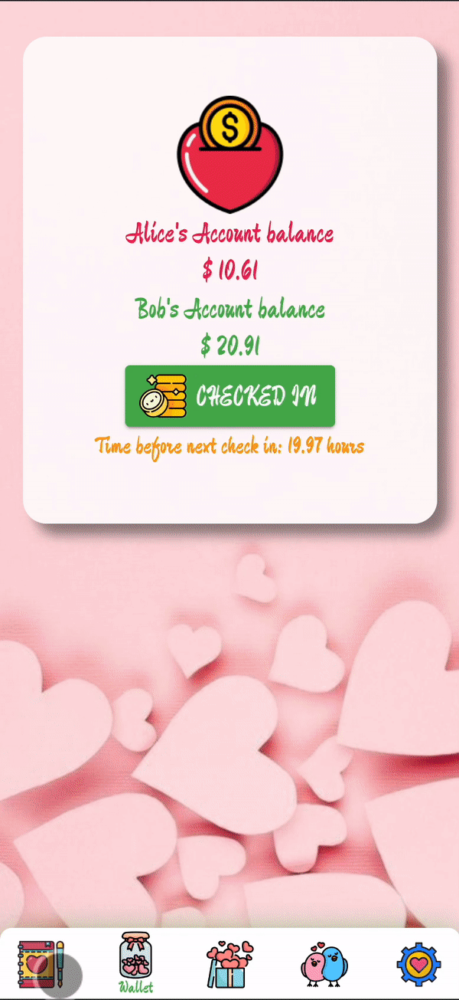
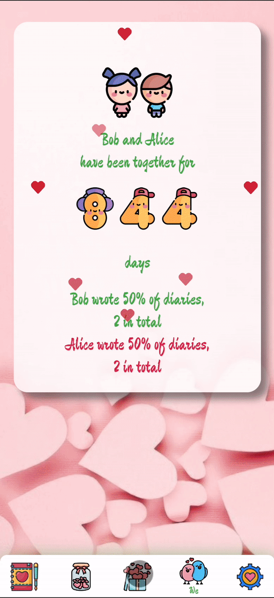
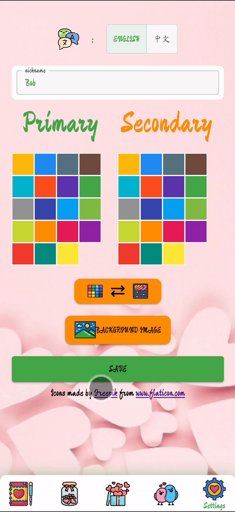
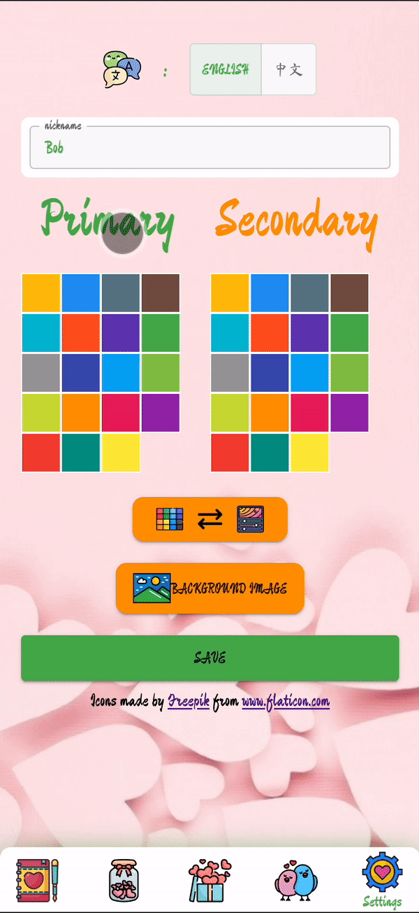
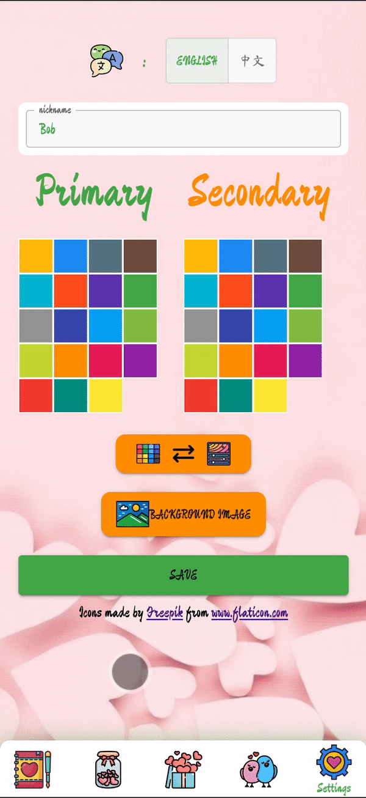

# Love Diary
> A social app I made for me and my love.

![NPM Version][npm-image]
![Node Version][node-image]
![React Version][react-image]


This is the version 2.0 of love-diary. Main change is migrate data from Deta to airtable.

Obviously for now the only users are me and her.

## Demo

https://dankai.vercel.app/

Try login with following users (password harcoded for testing purpose):

| Username | Password |
| -------- | -------- |
| Alice    | 111      |
| Bob      | 222      |

Just click the buttons on password pad.

## Installation

Clone or copy all files in your machine, go to the project folder, and

```sh
npm install
```
then
```sh
npm start
```

It will serve on http://localhost:3000

## Main feature

### Diary book

* Write diary

* Add photos

* View partner's diary

* Comment and reply



### Wallet

* Check in to get daily coin


### Magic Box

#### Background music list

* select favourite background music from list


#### Todo list

* set up todos
* view partner's todos
* archive today's todos
* show todos history
* get coin for each complete todo



#### Wishboard

* Add photos
* Write description


### Love dashboard

* Show the days we've been together
* Show diaries summary


### Settings

* Localization(English/Chinese)


* Nickname editing



* Theme color picker(primary/secondary)



* App background image




### Sounds and animation effects

* Applied rich sound and animation effects on user interactivation

## About us


<!-- Markdown link & img dfn's -->

[npm-image]: https://img.shields.io/badge/npm-v8.5.0-success
[node-image]: https://img.shields.io/badge/node-v16.14.2-success
[react-image]: https://img.shields.io/badge/react-v18.0.0-success

